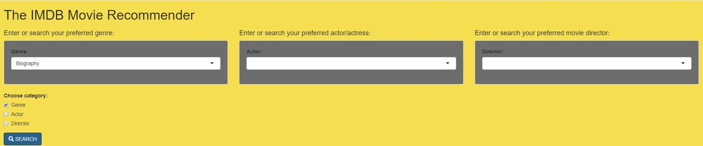

The IMDB Movie Recommender
========================================================
autosize: True
author: The Movie Runners

- Iwan bin Amri
- Naim Zuhair bin Mohd
- Irfan Syafiq bin Mohd Azli
- Muhammad Abdullah Zaki bin Mohd Fauzan

Date:  "`r format(Sys.time(), '%d %B %Y')`"

INTRODUCTION
========================================================

Do you like watching movies ? Have you ever been looking for recommendations ?

This presentation is our project report for The IMDB Movie Recommender Project of our Intro to Data Science group assignment.

Our goal for this project is to use data science knowledge in R language to create an app that helps movie lovers find movies they'll enjoy

The recommendations to the user are made from the IMDB top 1000 dataset provided in Kaggle.com 

- This is the dataset that is being used in the project.[https://www.kaggle.com/harshitshankhdhar/imdb-dataset-of-top-1000-movies-and-tv-shows]

DESCRIPTION AND WAYS TO USE The IMDB Movie Recommender
========================================================

This app recommends movies based on the users' preferred genre, actors and directors. It filters the dataset based on the users' input to find the best match.

- First, the user inputs their preferences into the genre, actor or director tabs. 
- Press Search and the app will filter the dataset to find movie with the related input and show it in a table.
- The app will list the movies according to the highest IMDB ratings and Metascores

Sample Display of the App
========================================================
The user will be recommended movie titles based on their preferences and can view their posters

Try The App Now
========================================================

This App is built using the basics of Data science and R programming.

Due to our lacking knowledge in machine learning and the limited dataset, the prediction method may has its own flaws. However we believe with a bigger dataset we can get better results. 

Although it was tough managing our time, we learned a lot of new things about how R programming can be implemented and the potential projects that can be achieved with the language.

The IMDB Movie Recommender can be accessed at:[https://s2132443.shinyapps.io/The_IMDB_Movie_Recommender/] 
The Github link for our code is at:[]

Hope you enjoy this presentation. Thank you.

